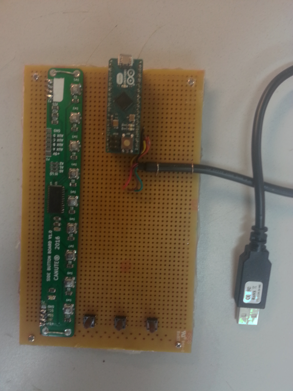

# Canute Driver Development Kit

Firmware and hardware to help with driver development of the Canute electronic Braille reader.

The dev kit consists of:

- An Arduino Leonardo or Pro Micro
- A custom button board that communicates via I2C
- 3 additional buttons wired to the custom button board
- A FTDI serial cable wired to the Arduino's hardware serial output

The nine buttons at the side are the "row buttons"; one button per row of Braille.
The three buttons at the bottom are the navigation buttons, left, enter and right.
These send kepresses 1-9, left, down and right respectively. 

The kit has two USB connections.
The first is on the Arduino and is the main serial port. 
Plugging in to this is analogous to plugging into the Canute braille machine.
You can send commands to this using the [protocol](#protocol).

The second is a debug port that outputs what the display is set to. 
Use the [debug_display.py](debug_display.py) script to display it. 
This script is written for Linux and expects the debug serial port to be on /dev/ttyUSB0.

## Prototcol

All serial lines are at 115200 Baud, 8n1. 
Every command echos the command being responded to followed by any return data which is mostly just a status byte. 
On the status byte 0 indicates an ok status.

| Command Name         |      Code | Description                                                        | Returns | 
| -------------------- | --------- | ------------------------------------------------------------------ | ------- |
| COMMAND_N_CHARACTERS |      0x00 | Number of characters pair row in the hardware                      | 2 bytes  |
| COMMAND_N_ROWS       |      0x01 | Number of rows on the display                                      | 2 bytes  |
| COMMAND_SEND_PAGE    |      0x02 | Deprecated                                                         | 2 bytes  |
| COMMAND_VERSION      |      0x03 | Outputs the firmware version                                       | 3 bytes |
| COMMAND_SEND_ERROR   |      0x04 | Command the Canute to make an error sound (currently unused)       | nothing |
| COMMAND_SEND_OK      |      0x05 | Command the Canute to make a confirmation sound (currently unused) | nothing |
| COMMAND_SEND_LINE    |      0x06 | Send the canute a row of braille to display                        | 2 bytes |
| COMMAND_RESET        |      0x07 | Reset the display (currently unused)                               | nothing |
| COMMAND_TEST_MODE    | ascii 't' | Go into a test mode (currently unused)                             | nothing |

COMMAND_SEND_LINE is the most useful command. With the first byte you indicate the line number (0 - 8) your are trying to set followed by the Braille data. 

|          | Command | Line number (0 - 8) | Braille Data |
| -------- | ------- | ------------------- | ------------ |
| Example: | 0x06    | 0x01                | ...          |

Canute only supports 6-dot braille and it is encoded as integers 0-64 in a binary fashion.

- 0b000000 is a space
- 0b000001 is a dot-1 i.e. 'a' i.e. '⠁' 
- 0b000010 is a dot-2 
- 0b000011 is a dots 1 and 2 
- ...
- 0b111111 is a braille cell with every dot raised

Effectively this means we are using unicode braille minus 10240.
